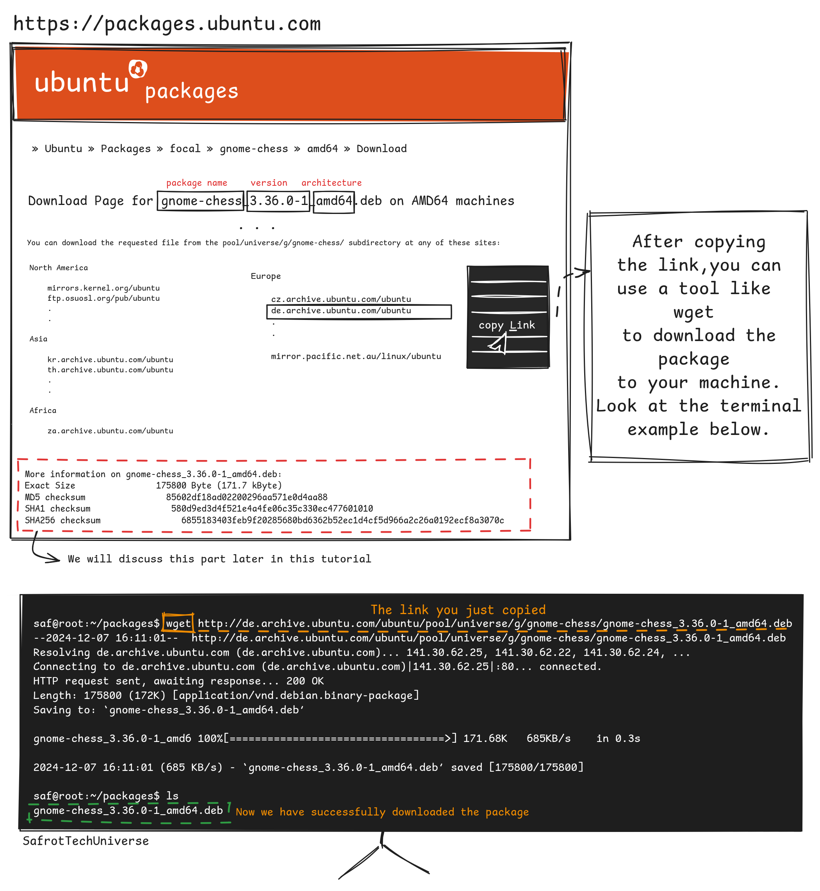

### Table of content

1. [Why we need a package manager.](#desc0)
2. [Types of packages in general.](#desc1)
3. [Types of packages specific to each distro.](#desc2)
4. [Working with the Debian package manager.](#desc3)

<a name="desc0"></a>
### Why we need a package manager.


<a name="desc1"></a>
### Types of packages in general.


<a name="desc2"></a>
### Types of packages specific to each distro.


<a name="desc3"></a>
### Working with the Debian package manager.

- The straightforward process when you try to install a package using the dpkg package manager.
   - Just go to [packages.ubuntu.com](https://packages.ubuntu.com), search for the package you want, copy the link, and use          ```wget``` to download the package to your machine as shown below.

      
