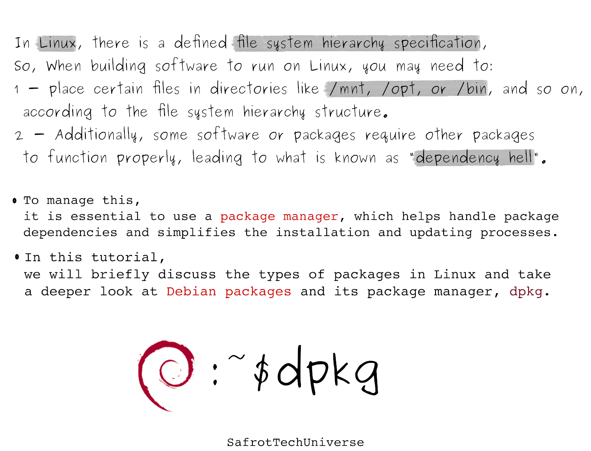
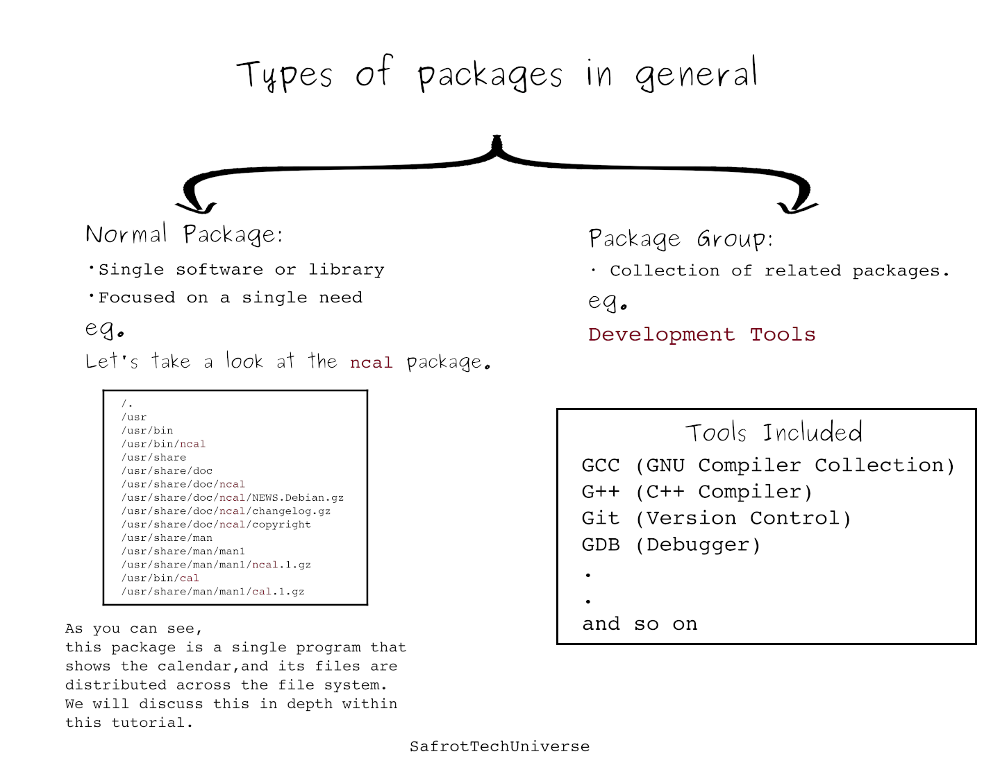
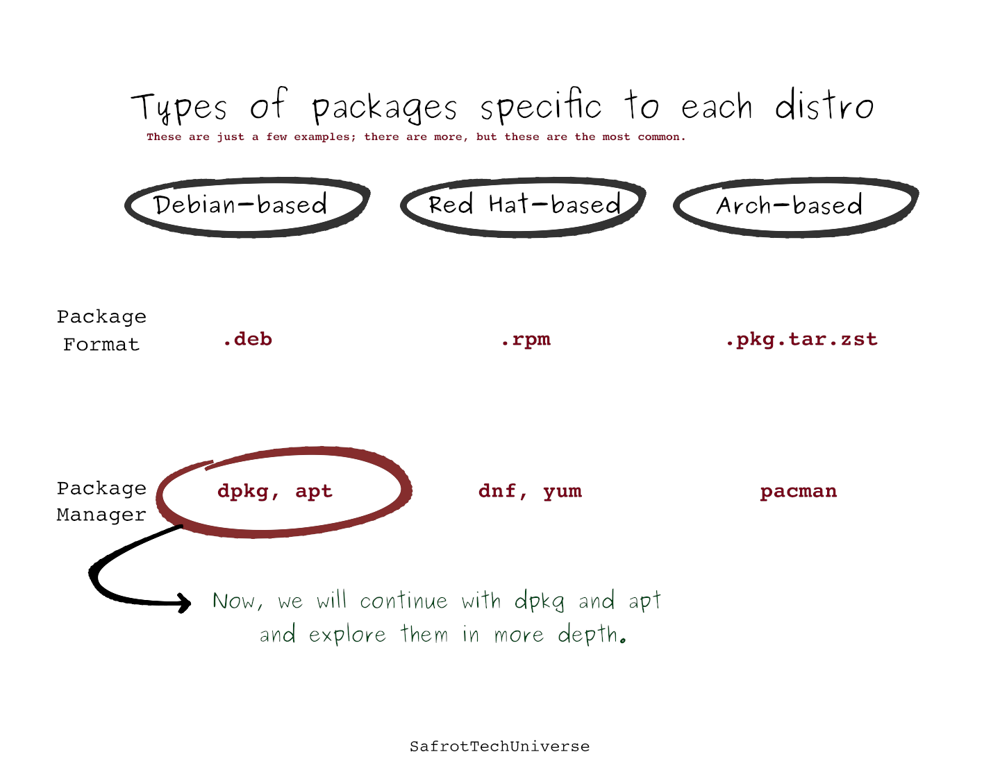

### Table of content

1. [Why we need a package manager.](#desc0)
2. [Types of packages in general.](#desc1)
3. [Types of packages specific to each distro.](#desc2)
4. [Working with the Debian package manager.](#desc3)

### Why we need a package manager.

### Types of packages in general.

### Types of packages specific to each distro.

