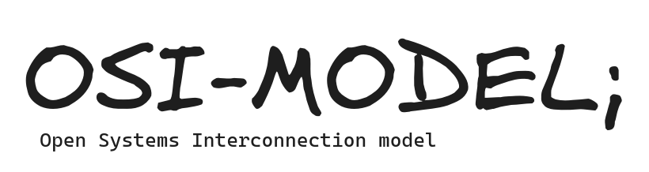

<p align="center">
  <br>
</p>

> [!NOTE]
> We will go through the OSI model and explore what actually happens when you type ```something.com``` until you receive a response. 
> We'll delve deeper into some interesting protocols along the way.
