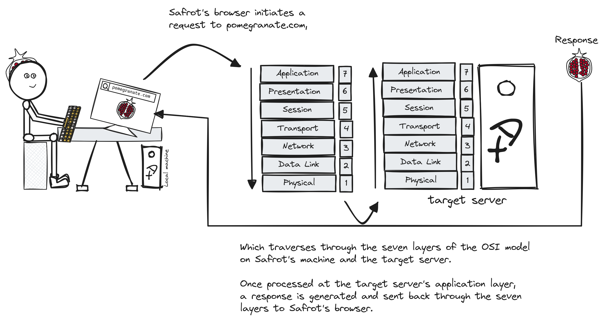
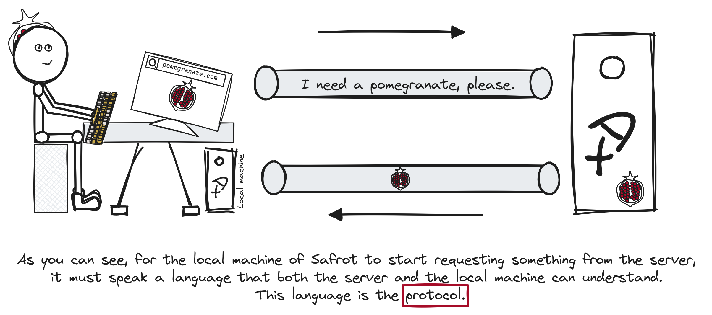
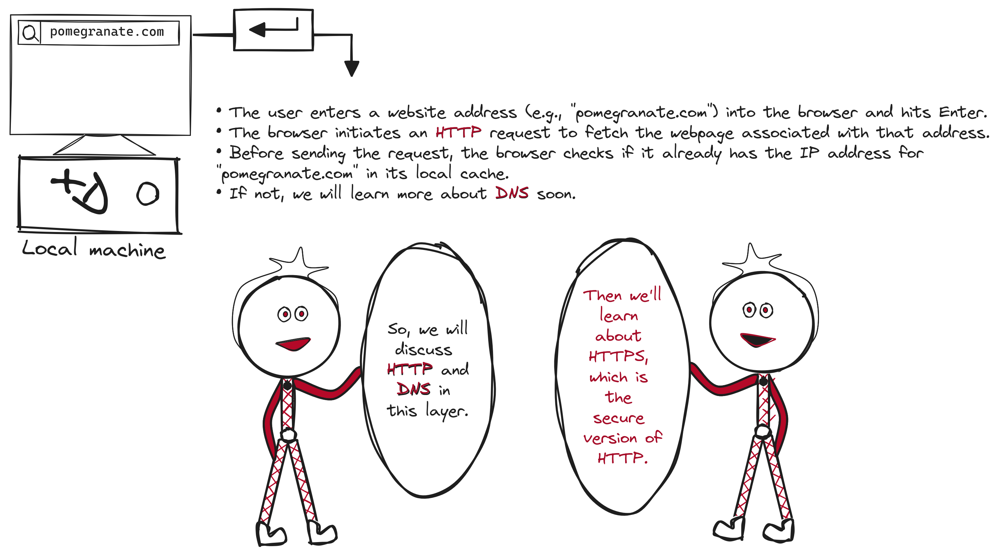
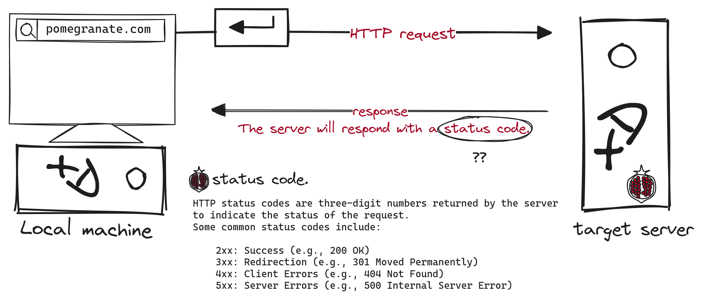

<p align="center">
  <br>
</p>

> [!NOTE]
> We will go through the OSI model and explore what actually happens when you type ```something.com``` until you receive a response. 
> We'll delve deeper into some interesting protocols along the way.

### Table of content
1. [Introduction.](#OSI-Intro)
2. [What is a Protocol?](#What-is-a-Protocol)
3. [Application layer.](#application-layer)

<a name="OSI-Intro"></a>
### Introduction.



<a name="What-is-a-Protocol"></a>
### What is a Protocol?


> [!NOTE]
> This is the basic overview of what a protocol is. Now, we will delve into the layers and explain some of those protocols with nitty-gritty details.

<a name="application-layer"></a>
### Application layer.
- The highest layer in the OSI model, focusing on providing network services to end-users and applications.
- It enables communication between different software applications and defines standards for data formatting and interaction across networks.
- Here are some examples of protocols operating at the application layer:
   ```diff
   + HTTP (Hypertext Transfer Protocol) - Transfers web pages and resources on the web.
   + HTTPS (Hypertext Transfer Protocol Secure) - Secure version of HTTP, encrypts communication.
   - FTP (File Transfer Protocol) - Transfers files between client and server.
   - SMTP (Simple Mail Transfer Protocol) - Sends and relays email messages.
   - POP3 (Post Office Protocol version 3) - Retrieves email messages from a server.
   - IMAP (Internet Message Access Protocol) - Accesses and manages email messages on a server.
   + DNS (Domain Name System) - Translates domain names to IP addresses.
   - DHCP (Dynamic Host Configuration Protocol) - Dynamically assigns IP addresses and network configuration.

- In this layer, we will only discuss protocols marked with green color.


- [HTTP (Hypertext Transfer Protocol).](#HTTP)
- [DNS (Domain Name System).](#)
- [HTTPS (Hypertext Transfer Protocol Secure).](#)

<a name="HTTP"></a>
#### HTTP (Hypertext Transfer Protocol).
   - What is HTTP?
   - HTTP History and Versions.
   - HTTP request.
   - HTTP method.
   - HTTP request headers.
   - HTTP request body.
   - HTTP response.
   - [HTTP status code.](#HTTP-res-status-code)
   - What are HTTP response headers?
   - What is in an HTTP response body?

 
<a name="HTTP-res-status-code"></a>
##### HTTP status code.

