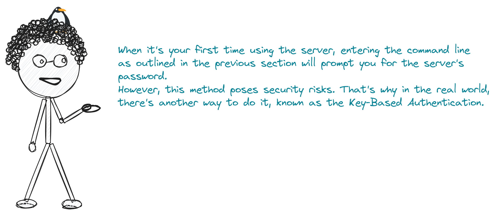

# Secure Shell Protocol (SSH);

### Table of content

1. [The idea behind SSH.](#desc0)
2. [Introduction](#desc1).
3. [What is OpenSSH?](#desc2)
4. [Setting up OpenSSH and ensuring that it is installed on your local machine.](#desc3)
5. [OpenSSH Server Configuration.](#desc4)
6. [Establishing SSH connection.](#desc5)
7. [Key-Based Authentication.](#desc6)

<a name="desc0"></a>
### The idea behind SSH


<a name="desc1"></a>
### Introduction


<a name="desc2"></a>
### What is [OpenSSH](https://www.openssh.com/)?

- [OpenSSH](https://www.openssh.com/) is the premier connectivity tool for remote login with the SSH protocol.
- Developed by [OpenBSD](https://www.openbsd.org/).
- SSH uses a ```client-server model```, which means that your machine is the client, and the machine you are connecting to is the server.


<a name="desc3"></a>
### Setting up OpenSSH and ensuring that it is installed on your local machine.


- If you are on an up-to-date operating system from the last five years, you probably have SSH installed.
- Many modern operating systems, including popular Linux distributions (e.g., Ubuntu, Fedora, Debian), macOS, and even some Windows distributions, come with SSH pre-installed or have easy ways to install it.

<a name="desc4"></a>
### OpenSSH Server Configuration.


<a name="desc5"></a>
### Establishing SSH connection.


<a name="desc6"></a>
### Key-Based Authentication.

- When it's your first time using the server, entering the command line as outlined in the previous section will prompt you for the server's password. However, this method has security risks. That's why in the real world, there's another way to do it, known as the ```key-based authentication``` method.
- In SSH communication, public-key cryptography is used for authentication with two keys: a public key and a private key. Here's a simplified explanation of how they work together:

##### 1. Key Generation And Distribution

- These keys are typically generated using the ```ssh-keygen``` program.
- The public key is shared with others, while the private key is kept secure and private.
- The public key is placed on the server that the user wants to access securely. This is usually done by adding the public key to the ```~/.ssh/authorized_keys``` file on the server.
- These two keys are cryptographically matched to each other

> [!NOTE]
>  The term ```cryptographically matched``` means that the public and private keys are mathematically related in such a way that data encrypted with one key can only be decrypted by the other key.
    The keys are generated together in a way that ensures this relationship.

##### 2. Initiating the Connection

- When the user attempts to connect to the server, the server sends back a message encrypted with the user's public key.
- This message can only be decrypted by the corresponding private key that the user has.

##### 3. Authentication Process

- When the user's SSH client decrypts the message using the private key, if the decrypted message matches a predefined challenge, the user is considered authenticated, and the connection is established.

##### 4. Secure Communication

- After authentication, the SSH session is established, and the communication between the client and server is encrypted using symmetric encryption.
- SSH switches to symmetric encryption for more efficient bulk data transfer after the initial authentication


> [!TIP]
> Symmetric encryption uses a single key for both encryption and decryption, while asymmetric encryption uses a pair of keys (public and private) for secure communication.
> 
> It's worth noting that discussions around these encryption methods can delve into more complexities. If you're interested in exploring further, feel free to dive into additional resources for a more in-depth understanding.

> [!IMPORTANT]
> Next, we'll showcase the featured articles for this week from the Safareet Magazine, diving into a detailed discussion of Key-Based Authentication in SSH.


