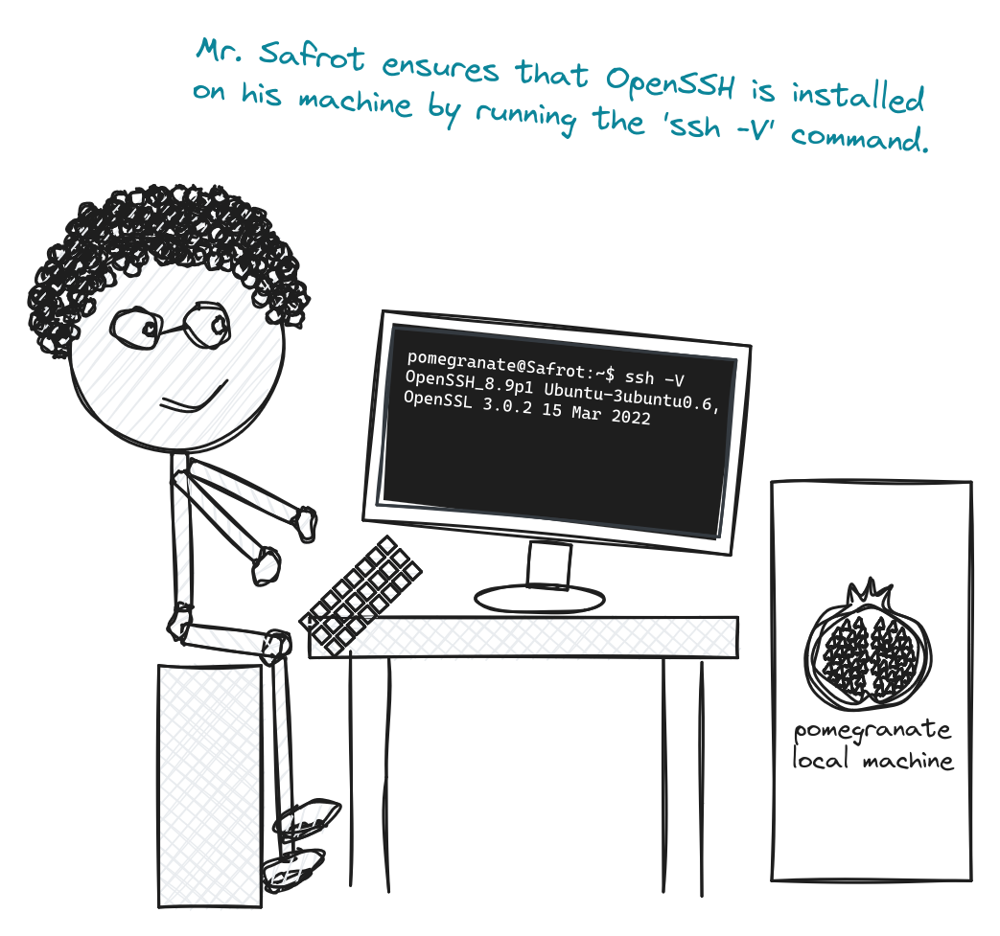
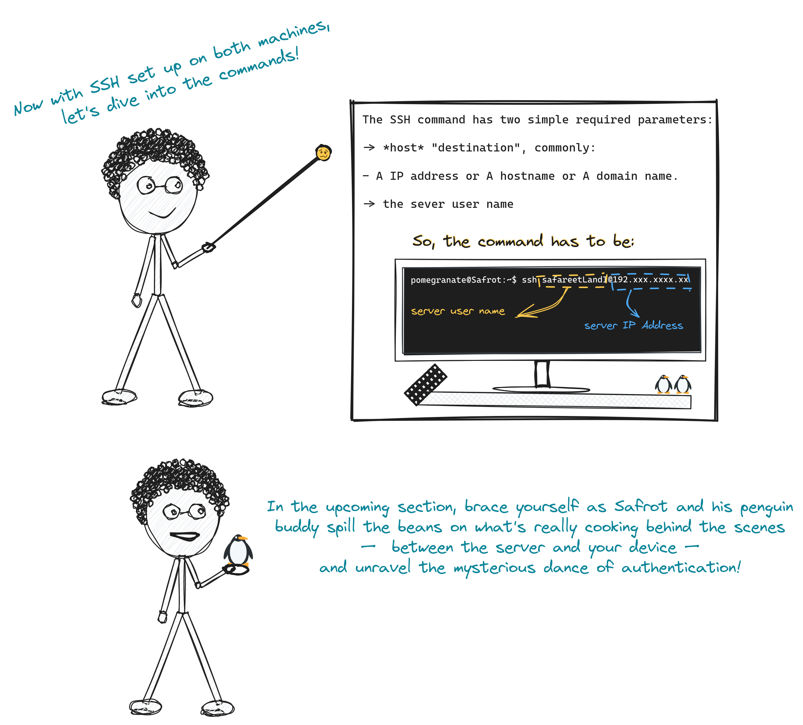

# Secure Shell Protocol (SSH);

### Table of content

1. [The idea behind SSH.](#desc0)
2. [Introduction](#desc1).
3. [What is OpenSSH?](#desc2)
4. [Setting up OpenSSH and ensuring that it is installed on your local machine.](#desc3)
5. [OpenSSH Server Configuration.](#desc4)
6. [Establishing SSH connection.](#desc5)
7. Key-Based Authentication.

<a name="desc0"></a>
### The idea behind SSH


<a name="desc1"></a>
### Introduction


<a name="desc2"></a>
### What is [OpenSSH](https://www.openssh.com/)?

- [OpenSSH](https://www.openssh.com/) is the premier connectivity tool for remote login with the SSH protocol.
- Developed by [OpenBSD](https://www.openbsd.org/).
- SSH uses a ```client-server model```, which means that your machine is the client, and the machine you are connecting to is the server.


<a name="desc3"></a>
### Setting up OpenSSH and ensuring that it is installed on your local machine.


- If you are on an up-to-date operating system from the last five years, you probably have SSH installed.
- Many modern operating systems, including popular Linux distributions (e.g., Ubuntu, Fedora, Debian), macOS, and even some Windows distributions, come with SSH pre-installed or have easy ways to install it.

<a name="desc4"></a>
### OpenSSH Server Configuration.


<a name="desc5"></a>
### Establishing SSH connection.


